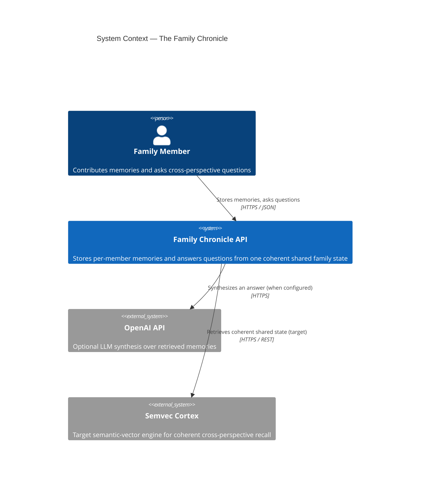

# C4 Level 1 — System Context

How the Family Chronicle fits among its users and neighbouring systems.

**Notes**
- One family = one **cluster** (`cluster_id`). All operations are cluster-scoped.
- OpenAI is optional: without a key, a deterministic keyword answer is returned.
- Semvec Cortex is the intended semantic backend; the abstraction is in place today
  (see [ADR-0002](../adr/0002-cortex-provider-abstraction.md)).
