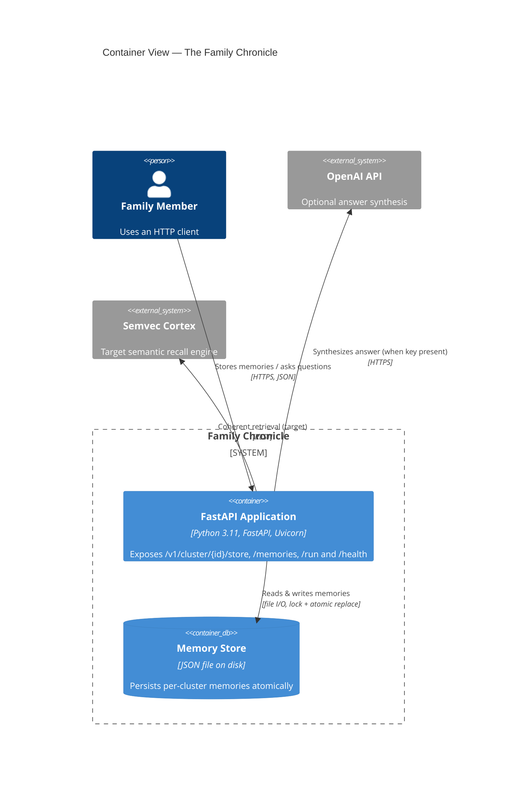

# C4 Level 2 — Container

The runtime containers inside the Family Chronicle system.

**Containers**
- **FastAPI Application** — the single deployable process; served headless via
  `uv run uvicorn main:app --host 0.0.0.0 --port 8000`.
- **Memory Store** — JSON file (`MEMORY_FILE`, default `memory_store.json`); chosen for
  zero-infra ([ADR-0004](../adr/0004-json-file-persistence.md)). Swappable for a vector store.
