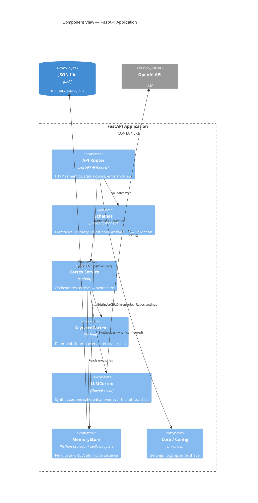

# C4 Level 3 — Component

Components inside the **FastAPI Application** container. This layered layout is
implemented in the `app/` package (M3 in the [implementation plan](../IMPLEMENTATION_PLAN.md));
root `main.py` is the thin `main:app` entrypoint that builds the app via `create_app()`.

**Responsibilities**
- **API Router** — maps HTTP to services; owns status codes (201/200/422) and the
  `{"error": {...}}` envelope.
- **Schemas** — Pydantic validation at the boundary.
- **Cortex Service** — the coherence engine: retrieve across **all** members, then
  synthesize one answer ([ADR-0002](../adr/0002-cortex-provider-abstraction.md),
  [ADR-0005](../adr/0005-answer-synthesis-strategy.md)).
- **KeywordCortex / LLMCortex** — pluggable providers; `SemvecCortex` is the target.
- **MemoryStore** — persistence protocol; JSON adapter for the demo.
- **Core/Config** — env-driven configuration and logging.
